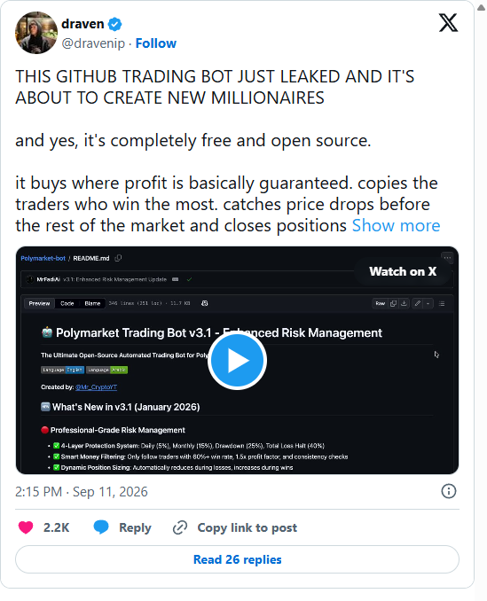

# 🤖 Polymarket Trading Bot v3.2 - Execution Safety & Backtesting

**The Ultimate Open-Source Automated Trading Bot for Polymarket**

[](README.md)
[](README_AR.md)

**Created by**: [@Mr_CryptoYT](https://x.com/Mr_CryptoYT)

## 🎥 Community Tutorials

| 📹 Video Walkthrough — [@dravenip](https://x.com/dravenip) (Sep 2026) | 📖 Complete Written Guide — [@Mr_CryptoYT](https://x.com/Mr_CryptoYT) (Jan 2026) |
| :---: | :---: |
| <a href="https://x.com/dravenip/status/2098384813921018281"></a> | <a href="https://x.com/Mr_CryptoYT/status/2010385899435991171"></a> |

## 🆕 What's New in v3.2 (September 2026)

### 🔧 **Execution Safety — All 13 Known Issues Resolved**
- ✅ **Fee-aware profits**: Arbitrage and DipArb subtract taker fees + gas and enforce a minimum net-profit gate (no more fee-blind signals)
- ✅ **Price-protected orders**: Every market order now sends worst-price caps/floors from the live order book — no more uncapped fills
- ✅ **Sequential arb execution**: YES/NO legs execute one after the other with unwind-on-partial-fill and residual reconciliation (no more dual-order race)
- ✅ **Tighter DipArb hedging**: Leg2 timeout 180s → 60s, new 20% stop-loss exit, 1:1 hedge enforced against actual on-chain fills
- ✅ **Fresh copy-trade quotes**: Stale whale prints are skipped (>5s), entries re-quote the live book with spread/premium/liquidity guards
- ✅ **Custom wallets gated**: Manually added wallets must pass the same WR/PnL/trades/profit-factor/consistency/whale filters as leaderboard picks
- ✅ **Exposure caps enforced**: Total (30%) and per-market exposure tracked, blocks new trades, shown in status
- ✅ **Configurable RPC**: `POLYGON_RPC_URL` env honored everywhere (no more hardcoded public endpoint)
- ✅ **Wallet circuit breaker**: Copy-trading disables a wallet after 3 consecutive failures (1h cooldown)
- ✅ **Backtesting harness**: JSONL order-book replay with fee/gas modeling (`npm run backtest`)
- ✅ **MATIC monitoring**: Gas balance polled every 5 minutes against the configured minimum, pauses trading when low
- ✅ **Sizing floor + streak pause**: Position sizing respects a USD minimum (skips instead of dust orders) and pauses after 6 straight losses

### 🛡️ **Protection System: 4 Layers → 6 Layers**
- ✅ **Layer 5**: Loss-streak pause (stops trading after 6 consecutive losses)
- ✅ **Layer 6**: Exposure cap (blocks new positions above 30% of capital)

## 🆕 What's New in v3.1 (January 2026)

### 🔴 **Professional-Grade Risk Management**
- ✅ **4-Layer Protection System**: Daily (5%), Monthly (15%), Drawdown (25%), Total Loss Halt (40%)
- ✅ **Smart Money Filtering**: Only follow traders with 60%+ win rate, 1.5x profit factor, and consistency checks
- ✅ **Dynamic Position Sizing**: Automatically reduces during losses, increases during wins
- ✅ **Enhanced Monitoring**: Real-time risk status with breach alerts

### 🛡️ **Safety Improvements**
- ✅ **Minimum Trade Enforcement**: All DipArb positions ≥ $1.50 (guaranteed exit capability)
- ✅ **Gas Fee Accounting**: Higher profit thresholds to cover transaction costs
- ✅ **Whale Trade Detection**: Prevents following lucky one-hit wonders
- ✅ **Permanent Halt**: Trading stops automatically at 40% total loss

This guide will take you **from A to Z** on how to set up, configure, and run your own trading bot safely.

---

## 📋 Table of Contents

1. [Prerequisites](#prerequisites)
2. [Installation](#installation)
3. [Configuration](#configuration)
4. [Running the Bot](#running-the-bot)
5. [Dashboard Guide](#dashboard-guide)
6. [Risk Management](#risk-management)
7. [Strategies Explained](#strategies-explained)
8. [Troubleshooting](#troubleshooting)
9. [Safety & Risks](#safety--risks)

---

## 1. Prerequisites

Before you start, you need three things:

### 💻 Computer Requirements
- **OS**: Windows, Mac, or Linux.
- **Node.js**: You must have Node.js installed (Version 18 or higher).
  - [Download Node.js here](https://nodejs.org/) (Choose "LTS" version).
- **Git**: Required to download the code.
  - [Download Git here](https://git-scm.com/).

### 💰 Wallet Requirements
- **A Polymarket Account**: Log in to [Polymarket.com](https://polymarket.com).
- **USDC (Polygon)**: You need funds to trade.
  - **USDC.e** is the specific token used on Polygon for Polymarket.
- **MATIC (Polygon)**: You need a small amount ($1-$5) for gas fees.

### 🔑 Private Key
- You need the **Private Key** of your wallet (e.g., from MetaMask or your Polymarket proxy wallet).
- *Security Note: Never share this key with anyone.*

---

## 2. Installation

Open your terminal (Command Prompt or PowerShell on Windows, Terminal on Mac) and run these commands one by one.

### Step 1: Clone the Repository
Download the bot code to your computer.

```bash
git clone https://github.com/MrFadiAi/Polymarket-bot.git
cd Polymarket-bot
```

*(Note: If you downloaded the ZIP file instead, just unzip it and open the folder in your terminal)*

### Step 2: Install Dependencies & Build Dashboard
This installs all the "parts" the bot needs to run and builds the dashboard interface.

```bash
# Install main dependencies
npm install

# Build the dashboard (Critical Step!)
cd dashboard
npm install
npm run build
cd ..
```

*This process might take 1-3 minutes.*

---

## 3. Configuration

This is the most important step. We need to tell the bot your wallet details.

### Step 1: Create the .env File
1. Find the file named `.env.example` in the folder.
2. Copy it and rename the copy to `.env`.

### Step 2: Add Your Credentials
Open the `.env` file with any text editor (Notepad, VS Code) and fill in your details:

```env
# ==============================================
# 🔑 WALLET CONFIGURATION (REQUIRED)
# ==============================================

# Your Wallet Private Key (Export from MetaMask)
# Format: 0x...
POLYMARKET_PRIVATE_KEY=0xYourPrivateKeyHere

# ==============================================
# ⚙️ BOT SETTINGS
# ==============================================

# CAPITAL (Your risk budget - NOT your wallet balance)
# This determines position sizes and risk limits
# Start with a small amount for testing
CAPITAL_USD=250

# DRY RUN MODE
# "true" = Simulation Mode (No real money used, SAFE to test)
# "false" = Live Trading (Real money used, BE CAREFUL)
DRY_RUN=true

# 🆕 RISK MANAGEMENT (Optional - defaults are conservative)
DAILY_MAX_LOSS_PCT=0.05      # 5% daily loss limit
MONTHLY_MAX_LOSS_PCT=0.15    # 15% monthly loss limit
MAX_DRAWDOWN_PCT=0.25        # 25% drawdown from peak
TOTAL_MAX_LOSS_PCT=0.40      # 40% total loss = permanent halt

# API Keys (Optional but recommended for speed)
# Get a free key from specific providers if you want better performance
# ALCHEMY_KEY=...

# Polygon RPC (Optional - avoids the rate-limited public endpoint)
# Get a free key from Alchemy/Infura/QuickNode and paste the HTTPS URL
# POLYGON_RPC_URL=https://polygon-mainnet.g.alchemy.com/v2/YOUR_KEY

# Dashboard security (Optional)
# The dashboard binds to localhost (127.0.0.1) by default. To reach it from
# another machine, set DASHBOARD_HOST=0.0.0.0 AND set a long random token —
# the token is required on the API/WebSocket and the bot prints the full
# dashboard URL (including ?token=...) at startup.
# DASHBOARD_HOST=127.0.0.1
# DASHBOARD_TOKEN=generate-a-long-random-string
```

**⚠️ IMPORTANT:** 
- Start with `DRY_RUN=true` and `CAPITAL_USD=50` for testing
- Only change to `DRY_RUN=false` when you are 100% sure everything works

---

## 4. Running the Bot

Now the fun part! Let's start the bot with the visual dashboard.

Run this command:

```bash
npx tsx bot-with-dashboard.ts
```

### What happens next?
1. The terminal will show startup logs.
2. It will verify your wallet connection.
3. **The Dashboard URL is printed in the terminal** at `http://localhost:3001` (if you set `DASHBOARD_TOKEN`, the printed URL includes `?token=...` — open that exact link).

If it doesn't open by itself, copy the URL from the terminal.

---

## 5. Dashboard Guide

The dashboard is your command center with **enhanced risk monitoring**.

### Main Panels
- **Mode Indicator**: Shows if you are in **🔴 LIVE** or **🟢 DRY RUN** mode.
- **Mode Toggle**: Click the "Switch to LIVE/DRY RUN" button to instantly switch modes.
- **Balances**: Real-time view of your MATIC and USDC.
- **PnL Panel**: Tracks your Profit and Loss per session.

### Risk Status
The bot enforces its risk limits internally (daily / monthly / drawdown / total-loss / loss-streak / exposure cap) and the **Risk Status panel** visualizes them live: loss-limit usage meters, drawdown from peak, open exposure vs cap, win/loss streaks, and a HALTED/PAUSED state badge.

### Quick Actions
- **Strategy Toggles**: Enable/disable strategies in real-time
- **Emergency Stop** (bottom of the Strategy Controls panel): instantly halts all strategies — trading stays blocked until you restart the bot
- **Panic Sell** (bottom of the Strategy Controls panel): closes up to 10 open positions at market price, with double confirmation

---

## 6. Risk Management

### 🆕 Multi-Layer Protection System

The bot now has **6 layers of protection** to safeguard your capital:

#### Layer 1: Daily Loss Limit (5%)
- **What it does**: Stops trading if you lose 5% in one day
- **Action**: Pauses for 60 minutes, then resumes
- **Example**: With $250 capital, stops at -$12.50 daily loss

#### Layer 2: Monthly Loss Limit (15%)
- **What it does**: Stops trading if you lose 15% in 30 days
- **Action**: Pauses for 30 days (rest of month)
- **Example**: With $250 capital, stops at -$37.50 monthly loss

#### Layer 3: Drawdown Limit (25%)
- **What it does**: Monitors drop from your peak capital
- **Action**: Pauses for 7 days if exceeded
- **Example**: Peak $300, stops if drops below $225

#### Layer 4: Total Loss Halt (40%)
- **What it does**: **PERMANENT HALT** if total loss reaches 40%
- **Action**: Stops trading entirely, requires manual restart
- **Example**: With $250 capital, halts at -$100 total loss

#### Layer 5: Loss-Streak Pause (🆕 v3.2)
- **What it does**: Stops trading after 6 consecutive losing trades
- **Action**: Pauses for 60 minutes, then resumes
- **Why**: Prevents revenge-trading spirals and oversized decay from dynamic sizing

#### Layer 6: Exposure Cap (🆕 v3.2)
- **What it does**: Blocks new positions when total open exposure exceeds 30% of capital (10% per market)
- **Action**: New signals are skipped until exposure drops
- **Example**: With $250 capital, no new trades above $75 total exposure

### 🆕 Smart Position Sizing

The bot now **adapts position sizes** based on performance:

- **Base Size**: 2% of capital (down from 3%)
- **During Losses**: Reduces by 20% per consecutive loss
- **During Wins**: Increases by 10% per consecutive win (capped at 5%)
- **Example**:
  - Normal: $250 × 2% = $5/trade
  - After 3 losses: $5 × 0.8 × 0.8 = $3.20/trade
  - After 5 wins: $5 × 1.4 = $7/trade (capped at $12.50)

---

## 7. Strategies Explained

The bot comes with 4 powerful strategies. You can toggle them ON/OFF in the dashboard.

### 1. ⚖️ Arbitrage
- **Concept**: Finds markets where `YES Price + NO Price < $1.00`.
- **Action**: Buys both sides immediately.
- **Profit**: Guaranteed math-based profit when the market resolves to $1.00.
- **🆕 v3.1**: Higher profit threshold (1%) to cover gas fees
- **Risk**: Extremely Low.

### 2. 📉 DipArb (Dip Arbitrage)
- **Concept**: Watches for panic selling in 15-minute crypto markets (BTC, ETH).
- **Trigger**: If price crashes >15% in 3 seconds.
- **Action**: Buys the dip (Leg 1) and hedges with the opposite side (Leg 2).
- **🆕 v3.1**: Minimum $1.50 trade value (all positions can be exited)
- **Risk**: Low-Medium (hedged positions).

### 3. 🐋 Smart Money (🆕 Enhanced)
- **Concept**: Tracks the top profitable traders on the leaderboard.
- **🆕 Strict Filtering**:
  - ✅ Minimum 60% win rate (up from 50%)
  - ✅ Minimum $500 total PnL (up from $100)
  - ✅ Profit Factor ≥ 1.5x (wins/losses ratio)
  - ✅ Consistency score 70%+ (recent performance)
  - ✅ No whale trades (max 30% PnL from one trade)
- **Action**: Copies their trades automatically.
- **Risk**: Medium (depends on trader quality).

### 4. ⚡ Direct Trading
- **Concept**: Tools for manual trading with super-powers.
- **Features**:
  - **FOK (Fill or Kill)**: Ensures your whole order fills or cancels.
  - **Sniper**: Quick buy buttons slightly above market price.
- **🆕 v3.1**: Stop-loss (15%), Take-profit (25%), Max hold (7 days)
- **Risk**: Controlled (with new limits).

---

## 8. Troubleshooting

**"Command not found" error?**
- Make sure you installed Node.js. Restart your computer if you just installed it.

**"Connection Failed"?**
- Check your internet.
- Verify your `POLYMARKET_PRIVATE_KEY` is correct in `.env`.

**"Insufficient Funds"?**
- You need both USDC (for trades) and MATIC (for gas) on the **Polygon Network**.

**"Trade value below minimum"?**
- This is the new $1.50 minimum protection. Increase your `CAPITAL_USD` or wait for better prices.

**Bot paused unexpectedly?**
- Check the Risk Status panel - you may have hit a daily/monthly/drawdown limit.
- This is a **safety feature** working as intended.

---

## 9. Safety & Risks

### ✅ Built-in Safety Features (v3.2)
1. **Multi-Layer Limits**: 6 levels of automatic protection (daily, monthly, drawdown, total halt, loss streak, exposure cap)
2. **Quality Trader Filtering**: Only follow proven, consistent traders (including custom wallets)
3. **Position Size Limits**: Maximum 5% per trade, USD minimum floor, adapts to performance
4. **Price-Protected Orders**: All market orders carry worst-price caps/floors from live books
5. **Sequential Hedged Execution**: No partial/unhedged fills left behind on failures
6. **Permanent Halt**: Trading stops at 40% total loss

### ⚠️ Your Responsibilities
1. **Private Keys**: Your key gives full access to your funds. Keep it safe.
2. **Start Small**: 
   - Use Dry Run first (24-48 hours)
   - Then test with $50 real money
   - Scale up gradually to $250+
3. **Monitor Regularly**: Check the Risk Status panel daily
4. **Understand Limits**: Know what triggers each safety layer
5. **Capital Management**: Set `CAPITAL_USD` to what you can afford to lose

### 📊 Recommended Testing Path

1. **Day 1-2**: Dry run mode (`DRY_RUN=true`, `CAPITAL_USD=50`)
2. **Day 3-9**: Live testing (`DRY_RUN=false`, `CAPITAL_USD=50`)
3. **Day 10+**: Scale up if profitable (`CAPITAL_USD=250`)

### 🚨 Emergency Actions

If something goes wrong:
1. Click "Emergency Stop" in dashboard
2. Or press `Ctrl+C` in terminal
3. Use "Panic Sell" only if absolutely necessary

---

## 📚 Additional Resources

- **Original SDK Documentation**: For developers who want to use the raw SDK, see [SDK_DOCUMENTATION.md](SDK_DOCUMENTATION.md).
- **Beginner Guide**: Step-by-step tutorial in [BEGINNER_GUIDE.md](BEGINNER_GUIDE.md).
- **Quick Start**: Fast setup guide in [QUICKSTART.md](QUICKSTART.md).
- **Community Tutorials**: Video walkthrough and full written guide — see [🎥 Community Tutorials](#-community-tutorials) at the top of this page.

---

## 📈 Version History

- **v3.2** (September 2026): Execution safety (fee-aware profits, price protection, sequential hedging), 6-layer protection, backtesting harness
- **v3.1** (January 2026): Enhanced Risk Management, Smart Money improvements, Dynamic sizing
- **v3.0** (December 2025): Dashboard, Multi-strategy support, Auto-rotation
- **v2.0** (November 2025): Smart Money, Arbitrage, DipArb strategies
- **v1.0** (October 2025): Initial release

---

**Created by**: [@Mr_CryptoYT](https://x.com/Mr_CryptoYT)

**Support**: Open an issue on GitHub or contact via Twitter

⚠️ **Disclaimer**: Trading involves risk. This bot does not guarantee profits. Always trade responsibly and never invest more than you can afford to lose.
